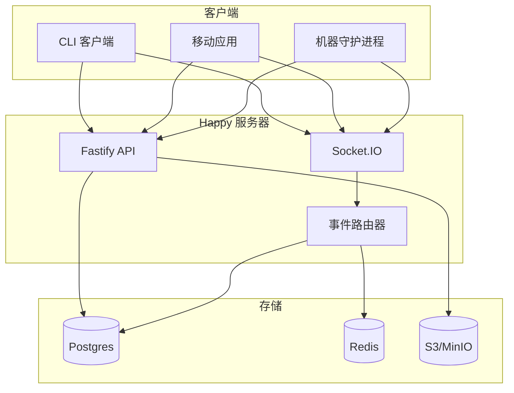
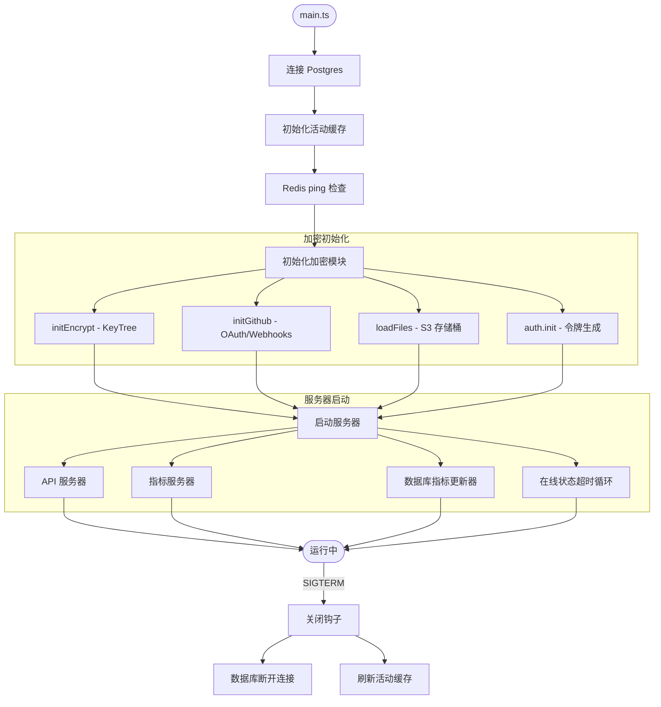
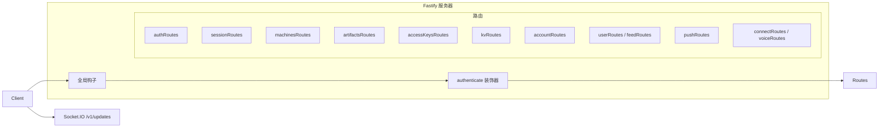
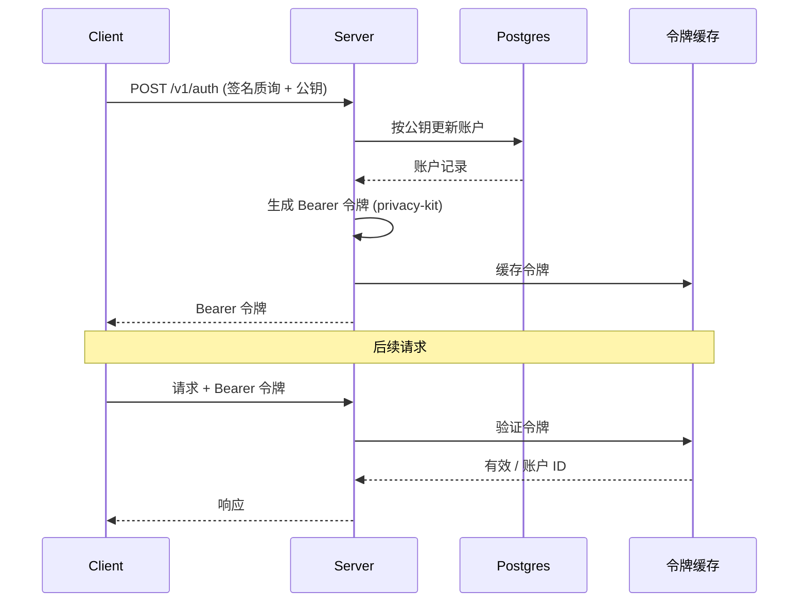
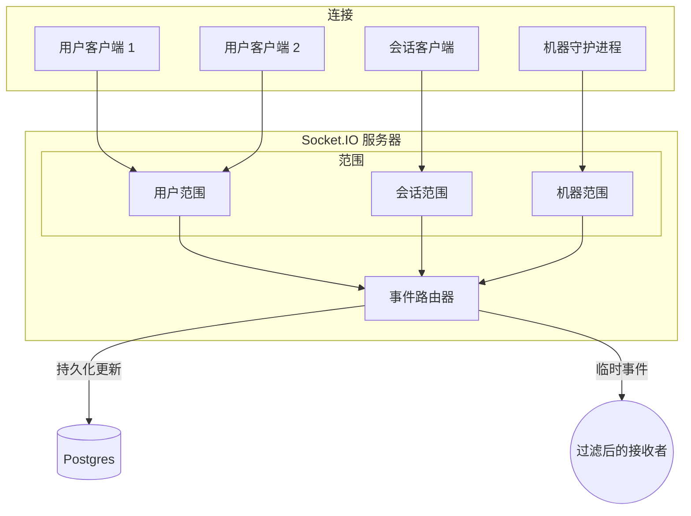
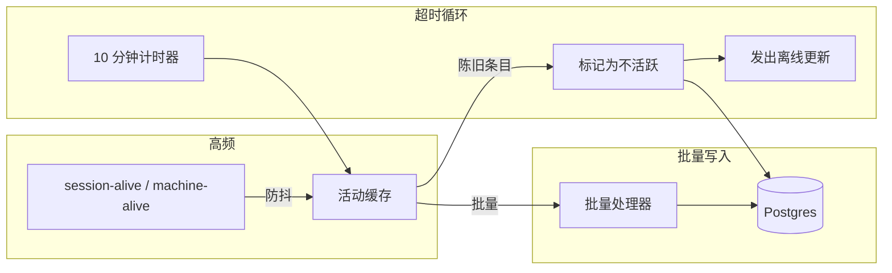
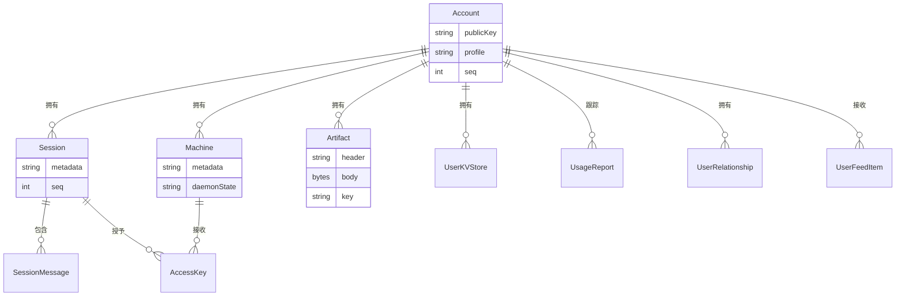
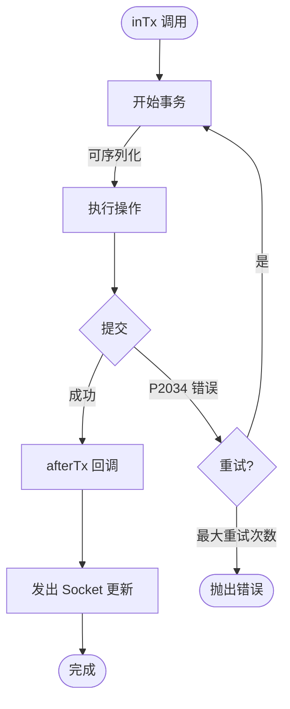
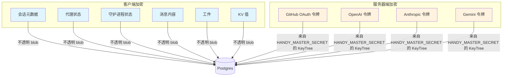

# 后端架构

本文档描述了 `packages/happy-server` 中实现的 Happy 后端结构。它重点关注服务器如何连接、数据如何流过系统以及哪些子系统处理哪些职责。

## 系统概述

## 概览
- 运行时: Node.js + Fastify 用于 HTTP，Socket.IO 用于实时通信。
- 数据库: 通过 Prisma 使用 Postgres。
- 缓存/总线: Redis 客户端已初始化（目前仅用于 ping 检查）。
-  blob 存储: 用于上传资产的 S3 兼容存储（MinIO）。
- 加密: privacy-kit 用于认证令牌和加密的服务令牌。
- 指标: Prometheus 风格的 `/metrics` 服务器 + 每个请求的 HTTP 指标。

## 进程生命周期
入口点: `packages/happy-server/sources/main.ts`。

启动序列：
1. 连接 Postgres (`db.$connect()`)。
2. 初始化活动缓存（在线状态）和 Redis 连接检查 (`redis.ping()`)。
3. 初始化加密模块：
   - `initEncrypt()` 从 `HANDY_MASTER_SECRET` 派生 KeyTree。
   - `initGithub()` 如果环境变量存在则配置 GitHub App/webhooks。
   - `loadFiles()` 验证 S3 存储桶访问。
   - `auth.init()` 准备令牌生成器/验证器。
4. 启动 API 服务器 (`startApi()`)、指标服务器、数据库指标更新器和在线状态超时循环。
5. 保持运行直到收到关闭信号。

已注册关闭钩子用于数据库断开连接和活动缓存刷新。

## API 层
`sources/app/api/api.ts` 中的 `startApi()` 连接 HTTP 服务器：
- 带有 Zod 验证器/序列化器的 Fastify 实例。
- 用于监控和错误处理的全局钩子。
- 验证 Bearer 令牌的 `authenticate` 装饰器。
- `sources/app/api/routes` 下的路由模块。
- 在 `/v1/updates` 上附加的 Socket.IO 服务器。

HTTP 路由按域组织：
- 认证 (`authRoutes`)
- 会话 + 消息 (`sessionRoutes`)
- 机器 (`machinesRoutes`)
- 工件 (`artifactsRoutes`)
- 访问密钥 (`accessKeysRoutes`)
- 键值存储 (`kvRoutes`)
- 账户 + 使用情况 (`accountRoutes`)
- 社交 + 动态 (`userRoutes`, `feedRoutes`)
- 推送令牌 (`pushRoutes`)
- 集成 (`connectRoutes`, `voiceRoutes`)
- 版本检查 (`versionRoutes`)
- 仅开发日志 (`devRoutes`)

## 认证和令牌

后端不存储密码。相反：
- 客户端使用公钥通过签名质询 (`/v1/auth`) 进行认证。
- 服务器按公钥更新账户并返回 Bearer 令牌。
- 令牌由 privacy-kit 使用 `HANDY_MASTER_SECRET` 生成和验证。
- 令牌缓存在内存中以进行快速验证。

GitHub OAuth 使用短寿命的"临时"令牌来保护回调，并且与正常认证分离。

## 实时同步架构

### 连接类型
Socket.IO 连接按范围标记：
- `user-scoped`（用户范围）: 接收所有用户更新。
- `session-scoped`（会话范围）: 仅接收一个会话的更新。
- `machine-scoped`（机器范围）: 用于机器状态的守护进程连接。

### 事件路由器
`EventRouter` (`sources/app/events/eventRouter.ts`) 维护每个用户的连接集并路由：
- **持久的 `update` 事件**: 带有用户级单调 `seq` 的数据库支持的更改。
- **临时事件**: 不持久化的在线状态/使用情况信号。

路由器实现接收者过滤器，以便更新仅发送给感兴趣的连接（例如，所有会话监听器或特定机器）。

### 更新序列号
- `Account.seq` 是每个用户的更新计数器。它由 `allocateUserSeq` 递增并用作 `UpdatePayload.seq`。
- 会话和工件维护它们自己的 `seq` 用于每个对象的排序。

## 在线状态和活动

在线状态在 `sources/app/presence` 中处理：
- `session-alive` 和 `machine-alive` 事件在内存中防抖（ActivityCache）。
- 数据库写入被批处理以减少写入负载。
- 超时循环在 10 分钟无活动后将会话/机器标记为不活跃，并发出一个离线临时更新。

这将高频在线状态与持久存储更新分开。

## 存储和持久化
### 数据库 (Prisma)
Prisma 模型位于 `prisma/schema.prisma` 中。关键表：

- `Account`: 公钥身份、个人资料、设置、seq 计数器。
- `Session` + `SessionMessage`: 加密的会话元数据和消息 blob。
- `Machine`: 加密的机器元数据 + 守护进程状态。
- `Artifact`: 加密的头部/正文 + 每个工件的密钥。
- `AccessKey`: 加密的每个会话每个机器的访问密钥。
- `UserKVStore`: 带有乐观版本的加密值。
- `UsageReport`: 每个会话/密钥的使用情况聚合。
- `UserRelationship` + `UserFeedItem`: 社交图和动态。

### 事务和重试

`inTx()` 用以下内容包装 Prisma 事务：
- 可序列化隔离。
- 在 `P2034`（序列化失败）时自动重试。
- `afterTx()` 在提交后发出 socket 更新。

此模式用于多写操作，如批量 KV 变更和会话删除。

### Blob 存储 (S3/MinIO)
服务器使用 S3 兼容存储来存储用户资产（例如头像）：
- `storage/files.ts` 配置 S3 客户端。
- `uploadImage` 处理和存储文件，并将元数据写入 `UploadedFile`。
- 公共 URL 从 `S3_PUBLIC_URL` 派生。

### Redis
Redis 客户端在 `main.ts` 中初始化并在启动时 ping。如果需要，可以扩展用于缓存或发布/订阅。

## 数据保密性模型

- 会话元数据、代理状态、守护进程状态和消息内容存储为不透明的加密字符串或 blob。
- 工件和 KV 值被加密存储并在网上编码为 base64。
- 服务器仅使用从 `HANDY_MASTER_SECRET` 派生的 KeyTree 加密/解密**服务令牌**（GitHub OAuth 令牌、供应商令牌）。

## 集成
- **GitHub**: OAuth 连接 + webhook 验证，如果设置了环境变量则为可选。
- **AI 供应商**: `openai`、`anthropic`、`gemini` 的加密令牌存储。
- **语音**: RevenueCat 订阅检查 + ElevenLabs 令牌生成。
- **推送令牌**: 存储用于以后的通知交付。

## 可观测性
- `/health` 路由检查数据库连接性。
- 指标服务器为 Prometheus 暴露 `/metrics`。
- HTTP 请求计数器和持续时间直方图通过 Fastify 钩子捕获。
- WebSocket 事件计数器和连接仪表在 `metrics2.ts` 中。

## 关键实现参考
- 入口点: `packages/happy-server/sources/main.ts`
- API 服务器: `packages/happy-server/sources/app/api/api.ts`
- Socket 服务器: `packages/happy-server/sources/app/api/socket.ts`
- 事件路由: `packages/happy-server/sources/app/events/eventRouter.ts`
- 在线状态: `packages/happy-server/sources/app/presence`
- 存储: `packages/happy-server/sources/storage`
- Prisma 模式: `packages/happy-server/prisma/schema.prisma`
