# CLI 架构

本文档描述 Happy CLI（`packages/happy-cli`）及其守护进程。CLI 既是一个交互式工具，也是一个后台会话管理器，用于保持机器状态与服务器同步。

## 系统概述

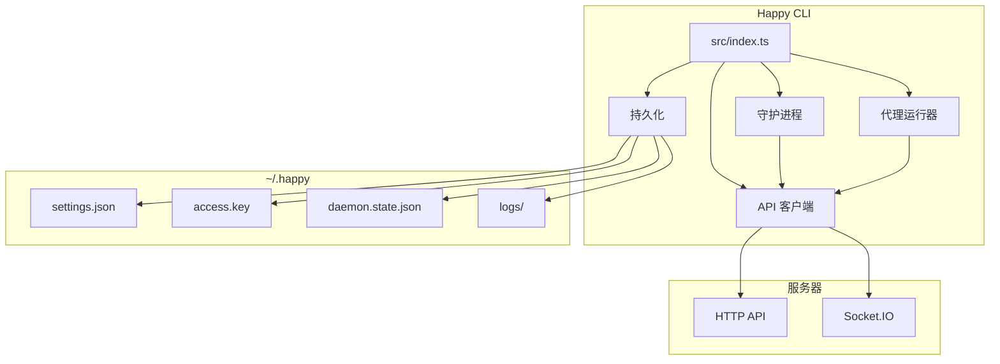

## 高级布局
- **入口点:** `src/index.ts` 解析子命令并路由执行。
- **API 客户端:** `src/api` 处理 HTTP + Socket.IO、加密和 RPC。
- **守护进程:** `src/daemon` 在后台运行、生成会话并维护机器状态。
- **持久化/配置:** `src/persistence.ts` + `src/configuration.ts` 管理 `~/.happy` 中的本地状态。
- **代理:** `src/claude`、`src/codex`、`src/gemini` 提供特定于供应商的运行器。

## CLI 入口流程

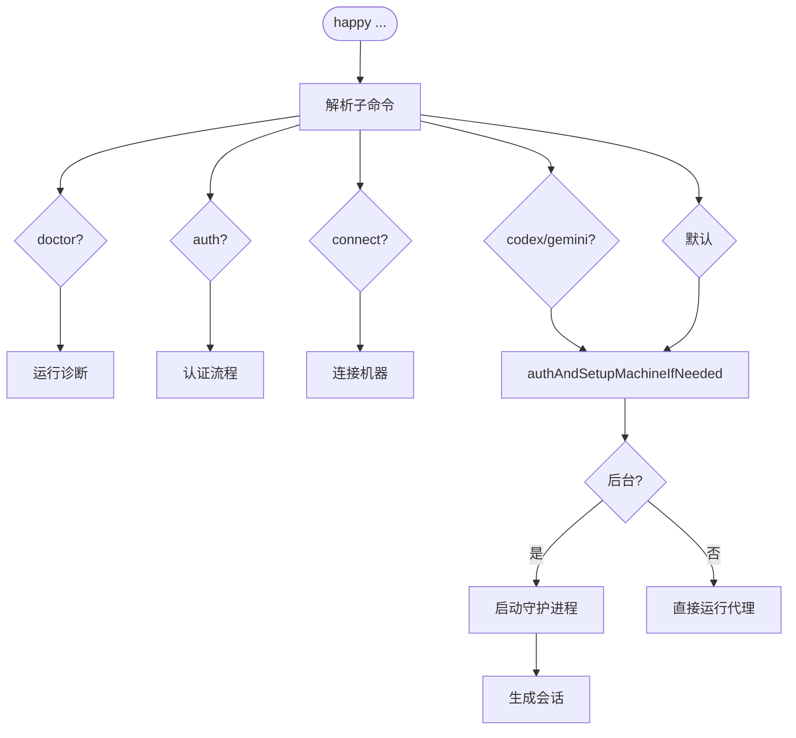

`src/index.ts` 是 CLI 路由器。它：
- 解析子命令（`doctor`、`auth`、`connect`、`codex`、`gemini` 和默认运行流程）。
- 在需要时确保认证和机器设置（`authAndSetupMachineIfNeeded`）。
- 根据子命令/上下文启动守护进程或直接运行代理。

## 本地状态和配置

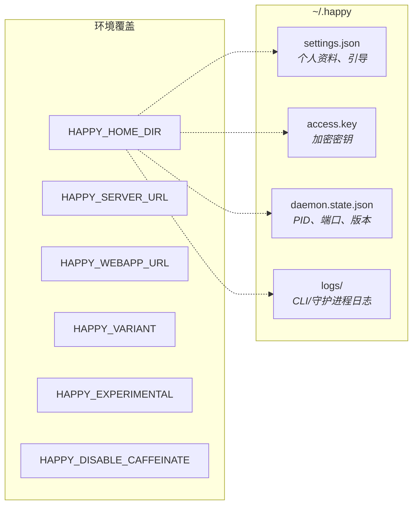

本地状态位于 `~/.happy`（或 `HAPPY_HOME_DIR`）下：
- `settings.json`: 引导和个人资料设置（已验证/迁移）。
- `access.key`: 用于加密/认证的本地密钥材料。
- `daemon.state.json`: 守护进程 PID + 控制端口 + 版本。
- `logs/`: CLI/守护进程日志。

配置位于 `src/configuration.ts`：
- `HAPPY_SERVER_URL` 和 `HAPPY_WEBAPP_URL` 覆盖默认值。
- `HAPPY_VARIANT`、`HAPPY_EXPERIMENTAL`、`HAPPY_DISABLE_CAFFEINATE` 控制行为。

## API 客户端架构

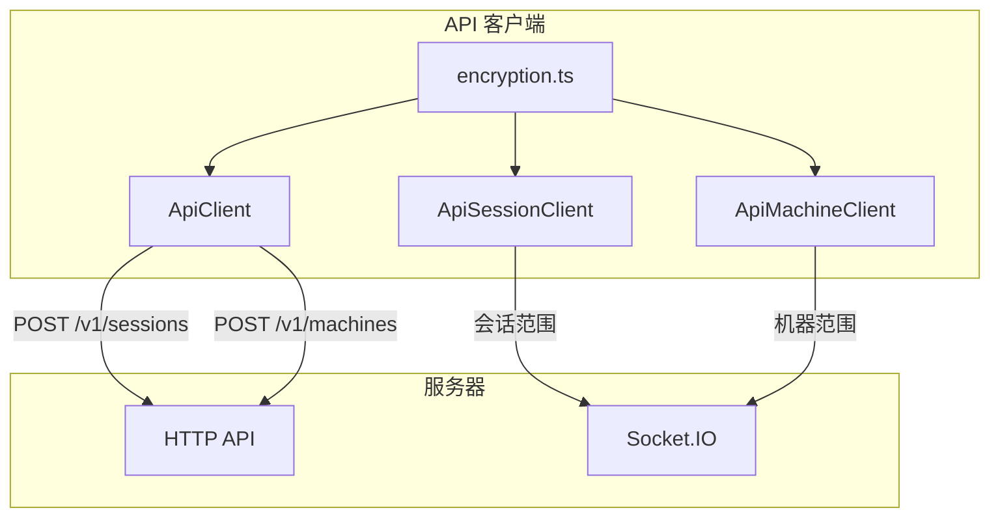

### HTTP
`ApiClient` (`src/api/api.ts`) 处理：
- 会话创建（`POST /v1/sessions`），带有加密的元数据/状态。
- 机器注册（`POST /v1/machines`），带有加密的元数据/守护进程状态。
- 通过 `ApiSessionClient` 和 `ApiMachineClient` 的其他 CRUD 操作。

### WebSocket

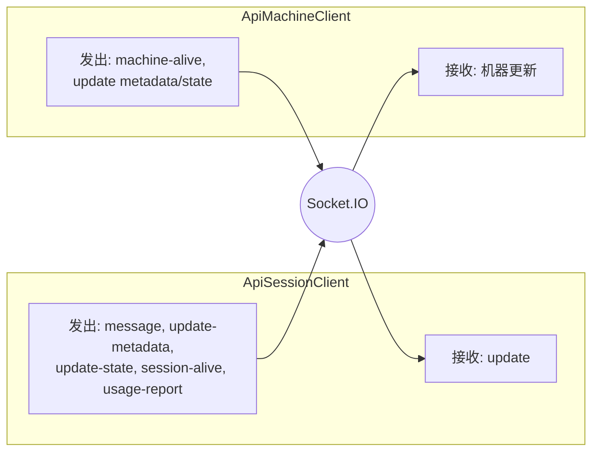

`ApiSessionClient` (`src/api/apiSession.ts`) 作为**会话范围**的客户端连接到 Socket.IO：
- 接收 `update` 事件并解密消息内容。
- 发出 `message`、`update-metadata`、`update-state`、`session-alive` 和 `usage-report`。

`ApiMachineClient` (`src/api/apiMachine.ts`) 作为**机器范围**的客户端连接：
- 发送 `machine-alive` 心跳。
- 使用乐观并发更新机器元数据/守护进程状态。
- 接收机器更新并在本地合并它们。

### 加密

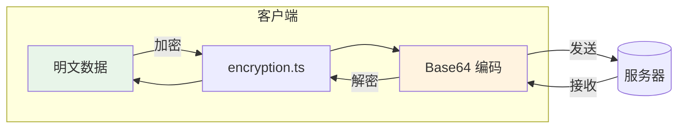

CLI 在客户端内容离开机器之前使用 `src/api/encryption.ts` 对其进行加密。
- 会话元数据、代理状态、消息、机器状态、工件和 KV 值在客户端进行加密。
- 线上编码为 base64；请参阅 `encryption.md`。

## 守护进程架构

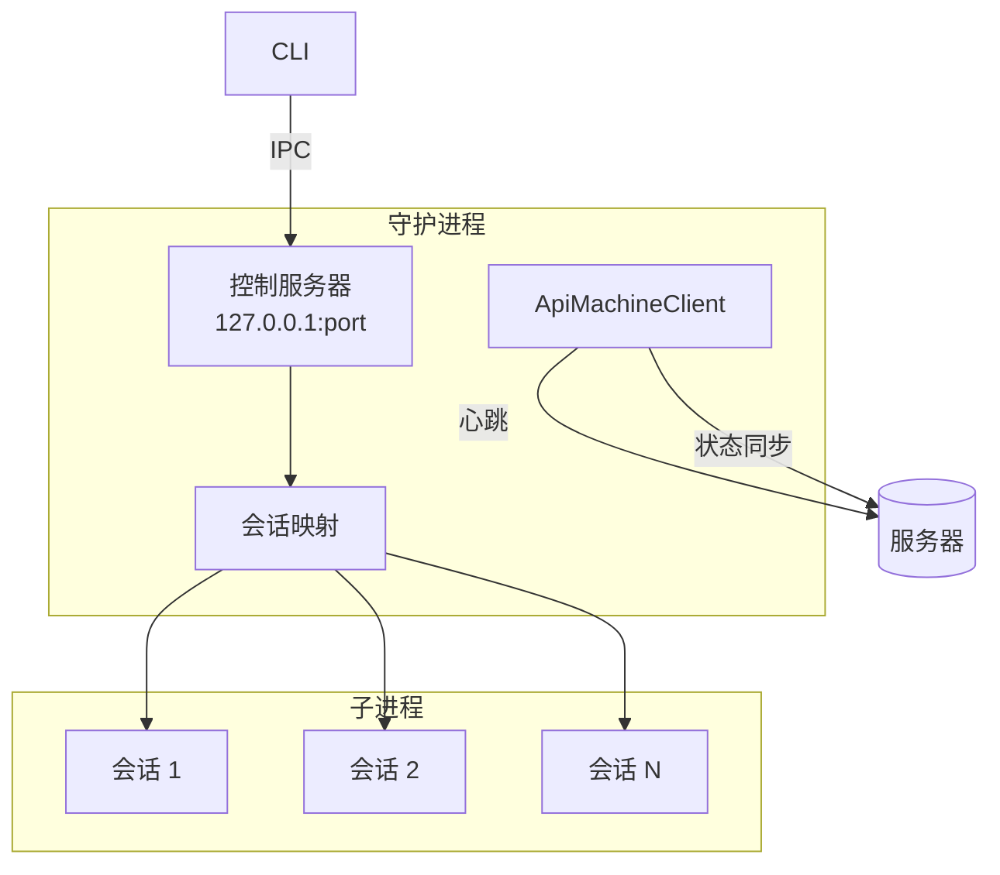

守护进程是一个长期运行的进程，负责在后台运行会话并维护机器在线状态。

### 生命周期

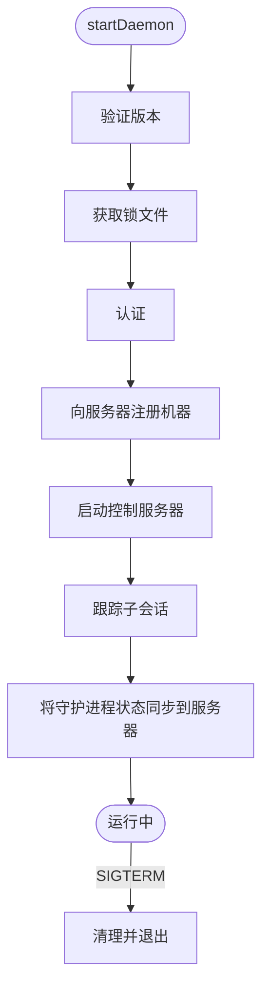

1. `startDaemon()` 验证运行版本并获取锁文件。
2. 它进行认证并向服务器注册机器。
3. 它启动一个本地**控制服务器**用于 IPC。
4. 它维护已跟踪子会话的映射，并在服务器上更新守护进程状态。

### 控制服务器（本地 IPC）

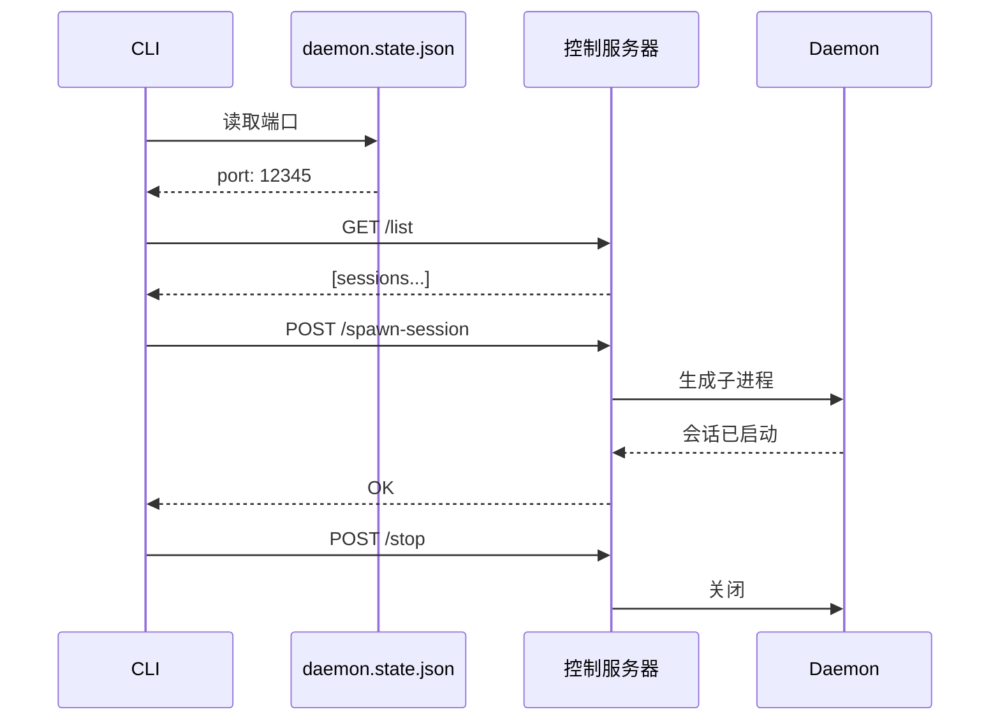

`startDaemonControlServer()` (`src/daemon/controlServer.ts`) 在 `127.0.0.1` 上运行一个 HTTP 服务器并暴露：
- `/list`（列出活动会话）
- `/stop-session`
- `/spawn-session`
- `/stop`（关闭守护进程）
- `/session-started`（会话自我报告）

CLI 通过 `controlClient.ts` 与此服务器通信，使用存储在 `daemon.state.json` 中的端口。

### 会话生成

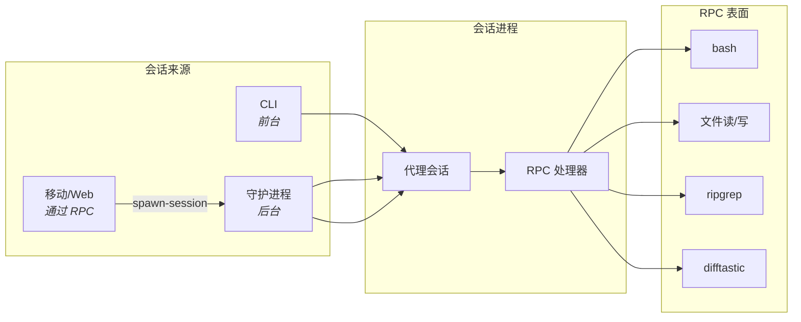

会话可以通过以下方式启动：
- 直接通过 CLI（前台）。
- 守护进程（后台）。
- 通过 RPC 的远程请求（通过机器连接来自移动/网页）。

守护进程会话生成使用 `registerCommonHandlers` 来暴露受控的 RPC 表面（shell 命令、文件操作、搜索/差异助手）。

### 机器状态

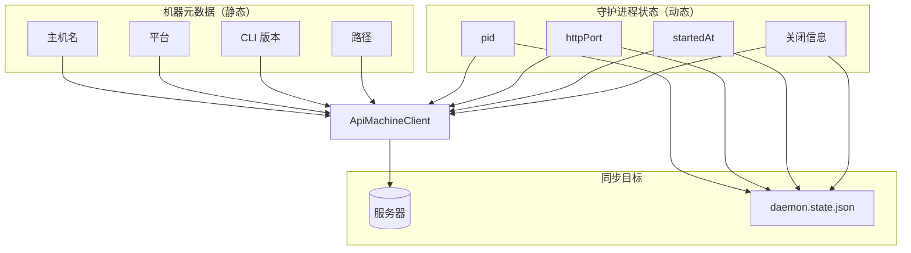

- **机器元数据** 是静态信息（主机名、平台、CLI 版本、路径）。
- **守护进程状态** 是动态的（pid、httpPort、startedAt、关闭信息）。

守护进程通过 `ApiMachineClient` 更新这些内容，并将本地状态镜像到 `daemon.state.json` 中用于控制/诊断。

## RPC 和工具桥接

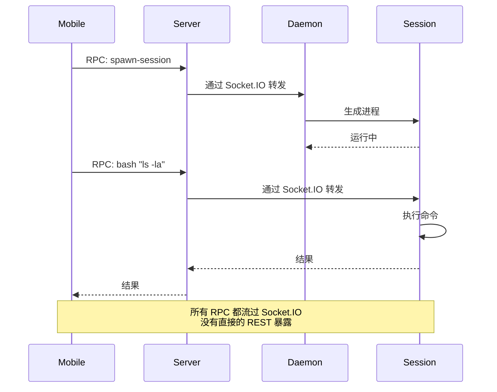

RPC 用于通过 Socket.IO 连接发送命令：
- 会话注册 RPC 处理器（例如 `bash`、文件读/写、`ripgrep`、`difftastic`）。
- 守护进程注册 spawn-session 处理器，以便服务器/移动客户端可以要求它启动本地会话。

此机制允许服务器和移动客户端驱动本地操作，而不暴露广泛的 REST 表面。

## 实现参考
- CLI 入口: `packages/happy-cli/src/index.ts`
- 守护进程: `packages/happy-cli/src/daemon`
- 控制服务器/客户端: `packages/happy-cli/src/daemon/controlServer.ts`、`packages/happy-cli/src/daemon/controlClient.ts`
- API 客户端: `packages/happy-cli/src/api`
- 持久化: `packages/happy-cli/src/persistence.ts`
- 配置: `packages/happy-cli/src/configuration.ts`
