# 加密和数据编码

本文档详细说明了客户端数据如何加密、加密 blob 的结构，以及这些 blob 如何映射到协议字段。它基于 `packages/happy-cli/src/api/encryption.ts` 和接受/发出这些值的服务器路由。

有关传输和事件形状，请参阅 `protocol.md`。有关 HTTP 端点，请参阅 `api.md`。

## 概述

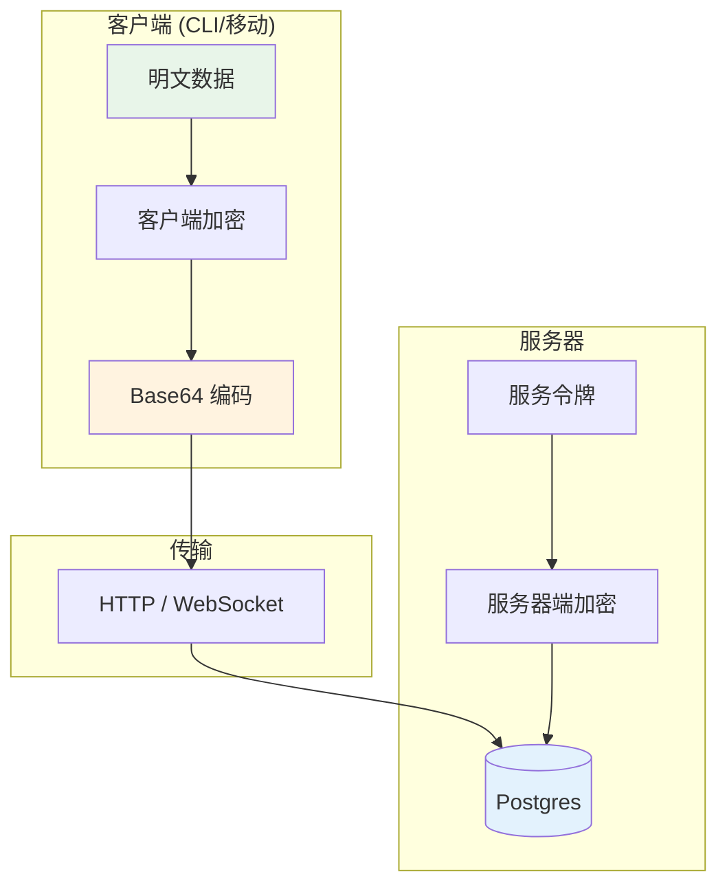

## 设计目标
- 保持服务器对用户内容不可见（客户端端到端加密）。
- 使用明确、稳定的二进制布局，以便客户端可以跨版本互操作。
- 在线路上偏好简单、一致的 base64 编码。

## 加密变体

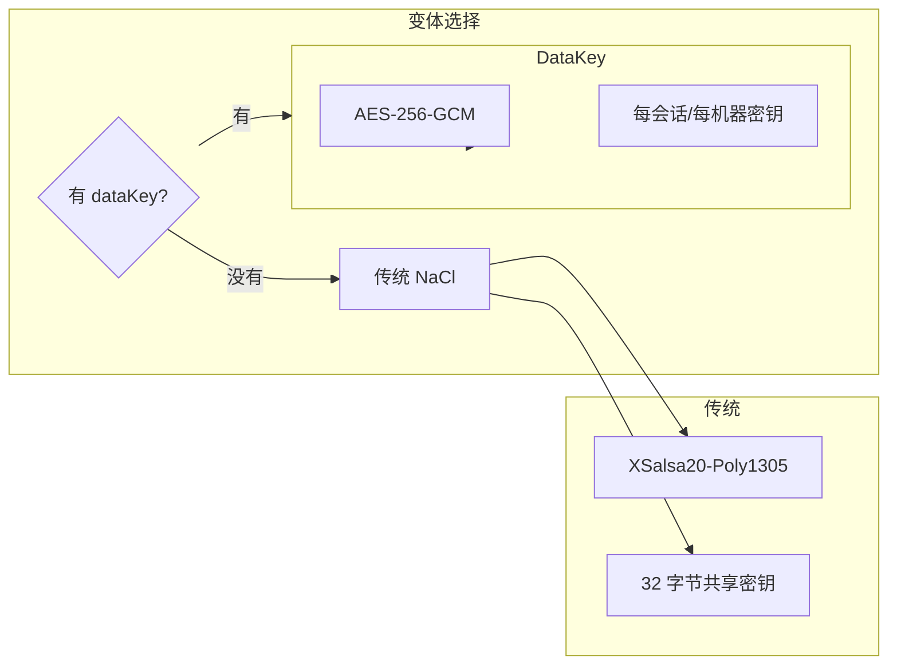

客户端目前使用两种加密变体之一：

### 1) legacy（NaCl secretbox）
当客户端只有共享密钥时使用。

**算法**：`tweetnacl.secretbox`（XSalsa20-Poly1305）
- **Nonce 长度**：24 字节
- **密钥长度**：32 字节

**二进制布局**（明文 JSON -> 字节）：
```
[ nonce (24) | ciphertext+auth (secretbox 输出) ]
```

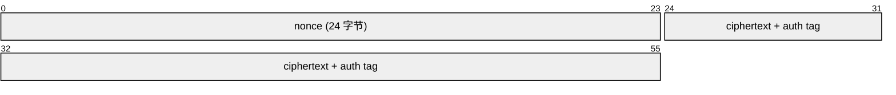

### 2) dataKey（AES-256-GCM）
当客户端支持每会话/每机器数据密钥时使用。

**算法**：AES-256-GCM
- **Nonce 长度**：12 字节
- **认证标签**：16 字节
- **密钥长度**：32 字节

**二进制布局**：
```
[ version (1) | nonce (12) | ciphertext (...) | authTag (16) ]
```

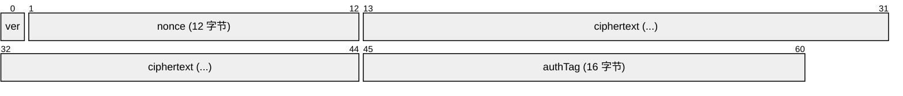

- `version` 目前为 `0`。

## 数据加密密钥（dataKey 变体）

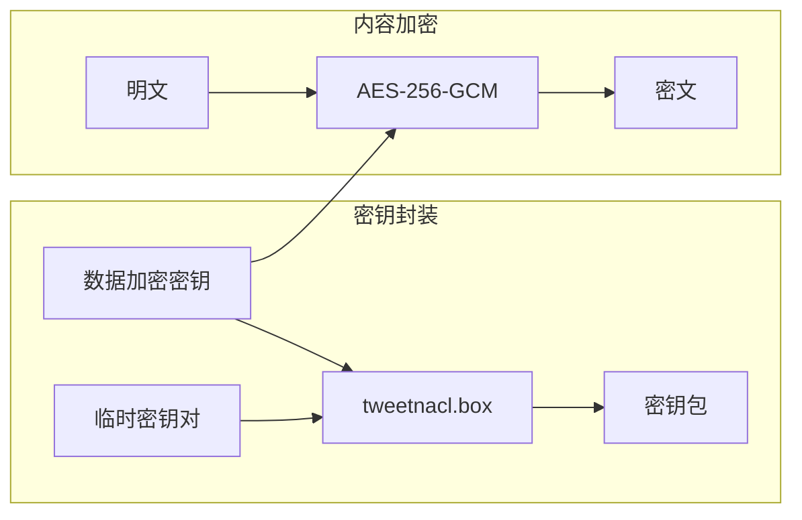

使用 `dataKey` 时，实际内容密钥会被加密以进行存储/传输。

**算法**：带有临时密钥对的 `tweetnacl.box`。
- **临时公钥**：32 字节
- **Nonce**：24 字节

**二进制布局**：
```
[ ephPublicKey (32) | nonce (24) | ciphertext (...) ]
```

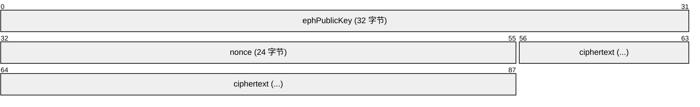

然后这个 blob 在发送/存储之前用版本字节包装：
```
[ version (1 = 0) | boxBundle (...) ]
```

生成的字节进行 base64 编码并放置在诸如会话/机器/工件的 `dataEncryptionKey` 等字段中。

## 加密应用位置

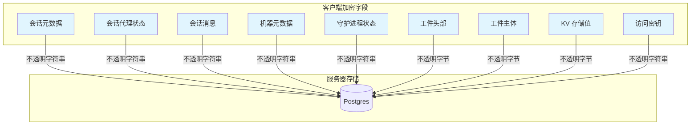

服务器将这些字段视为不透明字符串/blob。客户端在发送之前对它们进行加密。

### 会话元数据 + 代理状态
- **由客户端加密** 并在数据库中存储为字符串。
- 用于：
  - `POST /v1/sessions`（创建/加载）
  - WebSocket `update-metadata` / `update-state`
  - `update-session` 事件

### 会话消息

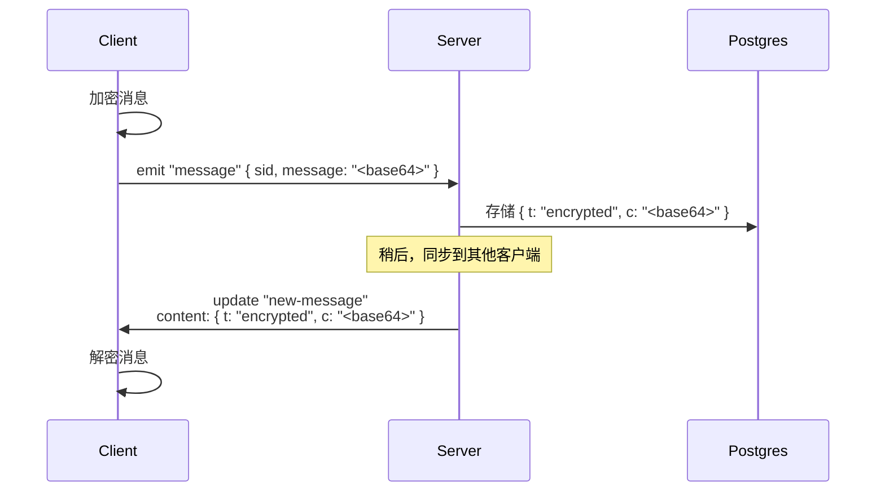

- 客户端发出带有 base64 加密 blob 的 `message`。
- 服务器将其存储为 `SessionMessage.content`：
  - `{ t: "encrypted", c: "<base64>" }`
- 服务器在 `new-message` 更新中以相同结构发出。

### 机器元数据 + 守护进程状态
- **由客户端加密** 并在数据库中存储为字符串。
- 用于：
  - `POST /v1/machines`
  - WebSocket `machine-update-metadata` / `machine-update-state`
  - `update-machine` 事件

### 工件
- `header` 和 `body` 是加密字节，在线路上编码为 base64。
- 在数据库中存储为 `Bytes`。
- 在 `new-artifact` / `update-artifact` 事件中作为 base64 字符串发出。

### 访问密钥
- `AccessKey.data` 被视为 **不透明的加密字符串**。
- 服务器不对其进行解码或检查其内容。

### 键值存储
- `UserKVStore.value` 是加密字节，在线路上编码为 base64。
- `kvMutate` 期望 base64 字符串；`kvGet/list/bulk` 返回 base64 字符串。

## 线上格式（加密字段）

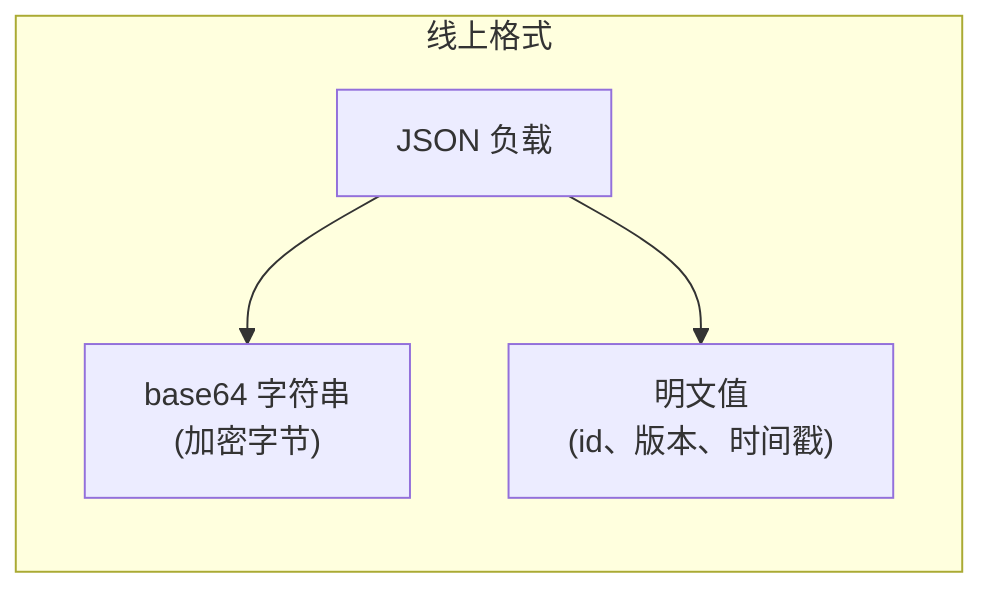

以下是携带加密数据的典型 JSON 形状。所有 `...` 值都是表示加密字节的 base64 字符串。

### 会话创建
```http
POST /v1/sessions
```
```json
{
  "tag": "<string>",
  "metadata": "<base64 加密>",
  "agentState": "<base64 加密或 null>",
  "dataEncryptionKey": "<base64 数据密钥包或 null>"
}
```

### 加密消息（客户端 -> 服务器）
```
Socket emit: "message"
```
```json
{
  "sid": "<会话 id>",
  "message": "<base64 加密>"
}
```

### 加密消息（服务器 -> 客户端）
```
update.body.t = "new-message"
```
```json
{
  "t": "encrypted",
  "c": "<base64 加密>"
}
```

### 会话元数据更新（WebSocket）
```
Socket emit: "update-metadata"
```
```json
{
  "sid": "<会话 id>",
  "metadata": "<base64 加密>",
  "expectedVersion": 3
}
```

### 机器更新（WebSocket）
```
Socket emit: "machine-update-state"
```
```json
{
  "machineId": "<机器 id>",
  "daemonState": "<base64 加密>",
  "expectedVersion": 2
}
```

### 工件创建/更新（HTTP）
```http
POST /v1/artifacts
```
```json
{
  "id": "<uuid>",
  "header": "<base64 加密>",
  "body": "<base64 加密>",
  "dataEncryptionKey": "<base64 数据密钥包>"
}
```

### KV 变更（HTTP）
```http
POST /v1/kv
```
```json
{
  "mutations": [
    { "key": "prefs.theme", "value": "<base64 加密>", "version": 2 },
    { "key": "prefs.legacy", "value": null, "version": 5 }
  ]
}
```

## 客户端类型（加密前使用的形状）
这些是被加密并通过线路发送的客户端结构。它们在 `packages/happy-cli/src/api/types.ts` 中定义。

### 会话消息内容（加密）
存储在 `SessionMessage.content` 中的负载始终被加密并包装为：
```json
{ "t": "encrypted", "c": "<base64 加密>" }
```

### 加密消息负载（加密前的明文）
消息被加密为 `MessageContent` 然后进行 base64 编码：

**用户消息**
```json
{
  "role": "user",
  "content": { "type": "text", "text": "..." },
  "localKey": "...",
  "meta": { }
}
```

**代理消息**
```json
{
  "role": "agent",
  "content": { "type": "output | codex | acp | event", "data": "..." },
  "meta": { }
}
```

### 元数据（加密）
```json
{
  "path": "...",
  "host": "...",
  "homeDir": "...",
  "happyHomeDir": "...",
  "happyLibDir": "...",
  "happyToolsDir": "...",
  "version": "...",
  "name": "...",
  "os": "...",
  "summary": { "text": "...", "updatedAt": 123 },
  "machineId": "...",
  "claudeSessionId": "...",
  "tools": ["..."],
  "slashCommands": ["..."],
  "startedFromDaemon": true,
  "hostPid": 12345,
  "startedBy": "daemon | terminal",
  "lifecycleState": "running | archiveRequested | archived",
  "lifecycleStateSince": 123,
  "archivedBy": "...",
  "archiveReason": "...",
  "flavor": "..."
}
```

### 代理状态（加密）
```json
{
  "controlledByUser": true,
  "requests": {
    "<id>": { "tool": "...", "arguments": {}, "createdAt": 123 }
  },
  "completedRequests": {
    "<id>": {
      "tool": "...",
      "arguments": {},
      "createdAt": 123,
      "completedAt": 123,
      "status": "canceled | denied | approved",
      "reason": "...",
      "mode": "default | acceptEdits | bypassPermissions | plan | read-only | safe-yolo | yolo",
      "decision": "approved | approved_for_session | denied | abort",
      "allowTools": ["..."]
    }
  }
}
```

### 机器元数据（加密）
```json
{
  "host": "...",
  "platform": "...",
  "happyCliVersion": "...",
  "homeDir": "...",
  "happyHomeDir": "...",
  "happyLibDir": "..."
}
```

### 守护进程状态（加密）
```json
{
  "status": "running | shutting-down",
  "pid": 123,
  "httpPort": 123,
  "startedAt": 123,
  "shutdownRequestedAt": 123,
  "shutdownSource": "mobile-app | cli | os-signal | unknown"
}
```

## 解密流程（客户端）

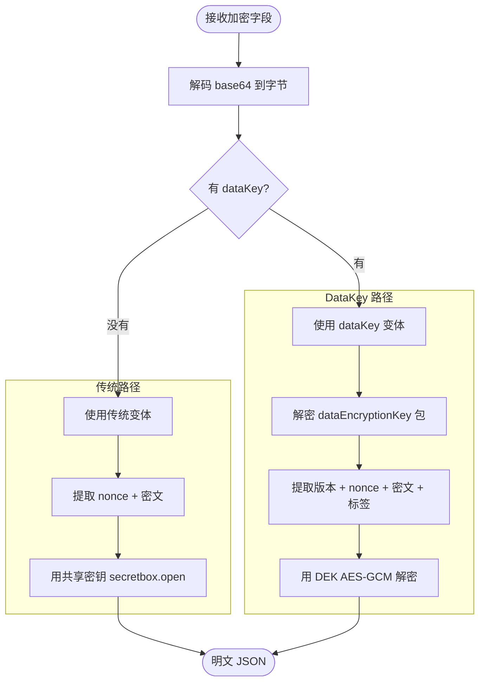

- 从 API/Socket 读取 base64 字段。
- 将 base64 解码为字节。
- 根据本地凭据选择加密变体（`legacy` 或 `dataKey`）。
- 使用适当的密钥和算法解密字节。

对于 `dataKey`，客户端必须首先从存储的 `dataEncryptionKey` 包中解密或派生每会话/每机器的数据密钥。

## 服务器端加密（服务令牌）

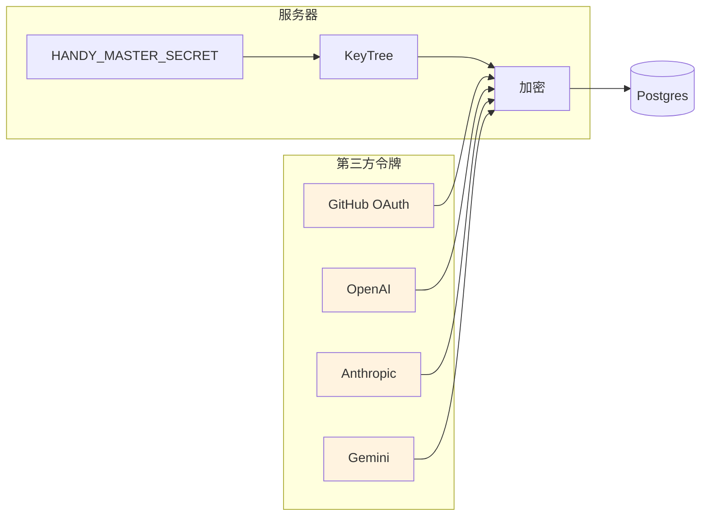

服务器在静态时加密某些第三方令牌：
- GitHub OAuth 令牌（`GithubUser.token`）。
- 供应商服务令牌（`ServiceAccountToken.token`）。

这些使用从 `HANDY_MASTER_SECRET` 派生的仅服务器 KeyTree 进行加密，不是端到端加密。

## 编码约定

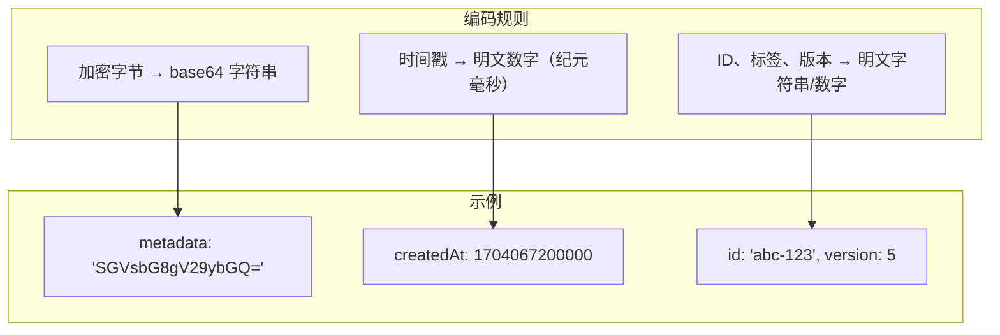

- 所有加密字节在线路上都是 base64 字符串，除非明确说明。
- 时间戳保持为明文数字（纪元毫秒），不由服务器加密。
- 非加密标识符（id、标签、版本）始终是明文字符串/数字。

## 实现参考
- 客户端加密：`packages/happy-cli/src/api/encryption.ts`
- 会话消息格式：`packages/happy-cli/src/api/types.ts`
- 服务器消息接收：`packages/happy-server/sources/app/api/socket/sessionUpdateHandler.ts`
- 工件/KV 路由：`packages/happy-server/sources/app/api/routes/artifactsRoutes.ts`、`packages/happy-server/sources/app/kv/kvMutate.ts`
