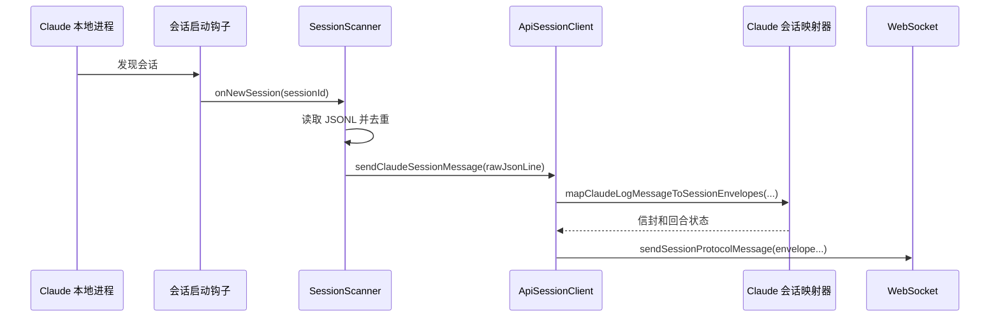
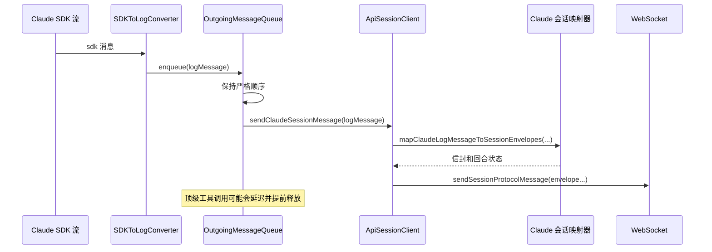
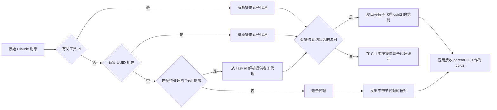
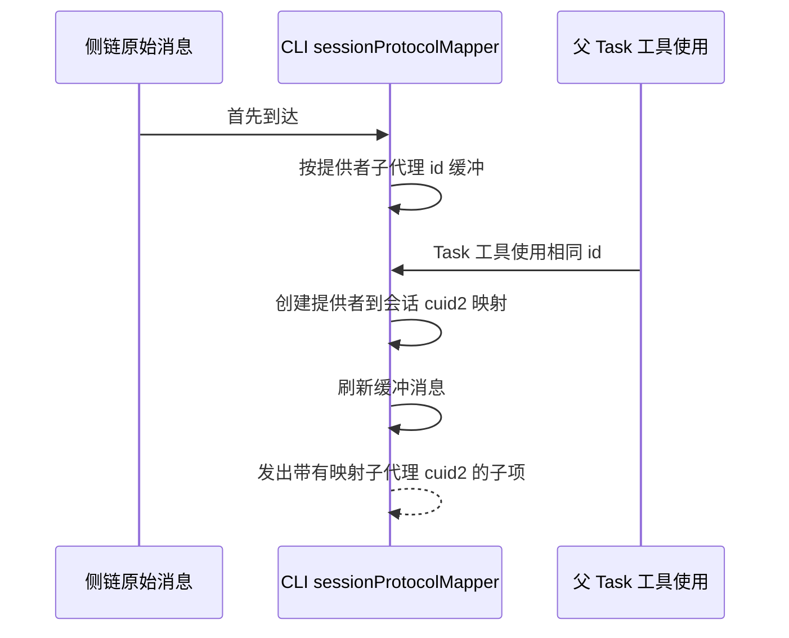
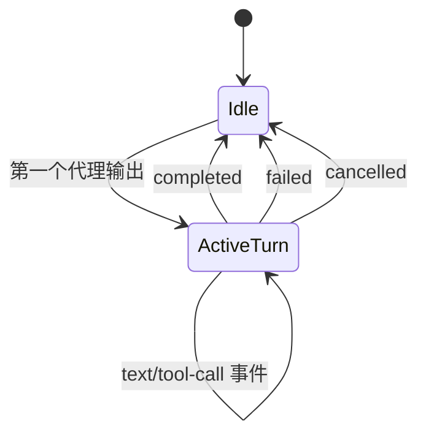

# Claude 会话协议（本地 + 远程）

本文档解释了 Claude 启动器路径如何发出统一会话协议（`content.type = "session"`），以及如何跨会话更改/重启避免重复消息。

## 范围

- 本地启动器路径：`claudeLocalLauncher` + `sessionScanner`（基于文件的 JSONL 摄入）
- 远程启动器路径：`claudeRemoteLauncher` + SDK 流 + `OutgoingMessageQueue`
- 共享协议发送器：`ApiSessionClient.sendClaudeSessionMessage()`

## 关键组件

- `packages/happy-cli/src/api/apiSession.ts`
  - `sendClaudeSessionMessage(...)` 将 Claude 记录映射到会话信封并发送它们。
  - `closeClaudeSessionTurn(status)` 发出带有 `completed|failed|cancelled` 的 `turn-end`。
- `packages/happy-cli/src/claude/utils/sessionProtocolMapper.ts`
  - Claude RawJSONLines -> 会话协议信封。
  - 维护 `currentTurnId` 状态。
- `packages/happy-cli/src/claude/utils/sessionScanner.ts`
  - 带有消息去重的本地模式文件扫描器。
- `packages/happy-cli/src/claude/utils/OutgoingMessageQueue.ts`
  - 远程模式有序的传出队列。

## 本地启动器流程

### 序列



### 本地回合关闭行为

- 中止/切换：`turn-end(status="cancelled")`
- 正常进程退出：`turn-end(status="completed")`
- 非零启动器退出/错误：`turn-end(status="failed")`

实现在：
- `packages/happy-cli/src/claude/claudeLocalLauncher.ts`

## 远程启动器流程

### 序列



### 远程回合关闭行为

- 在远程 `onReady` 时：`turn-end(status="completed")`
- 在中止时：`turn-end(status="cancelled")`
- 在启动器错误时：`turn-end(status="failed")`

实现在：
- `packages/happy-cli/src/claude/claudeRemoteLauncher.ts`

## 映射规则（Claude -> 会话协议）

| Claude 原始消息 | 会话信封 |
|---|---|
| `assistant` 文本块 | `agent:text` |
| `assistant` 思考块 | `agent:text` 带有 `thinking: true` |
| `assistant` tool_use 块（非 Task）| `agent:tool-call-start` |
| `assistant` tool_use 块（`Task`）| 无父工具调用信封；注册提供者 -> 会话子代理映射并刷新缓冲的子代理消息 |
| `user` tool_result 块（非 Task）| `agent:tool-call-end` |
| `user` tool_result 块（`Task` 父结果）| 子代理的 `agent:stop`（无父 `tool-call-end`）|
| `user` 纯字符串（非侧链）| `turn-end(completed)`（如果打开），然后发出 `user:text`（传统）和 `session:text`（迁移影子副本）|
| `user` 纯字符串（侧链）| `agent:start`（一次）然后 `agent:text`（`subagent` 设置为会话 cuid2）|
| `system` | 协议输出忽略 |
| `summary` | 协议输出忽略（仅元数据更新）|

注意：
- 回合在回合中的第一个代理输出时延迟启动（`turn-start` 信封在需要时创建）。
- 发出的协议信封中的 `turn` 值是 cuid2（下面的示例为了可读性使用 `tA` 简写）。
- 侧链链接在信封上使用 `subagent`，`subagent` 始终是会话 cuid2。
- 映射器跟踪 `providerSubagentToSessionSubagent`，因此提供者工具 id（Claude `toolu_*`）永远不会泄漏到协议信封中。
- 如果缺少 `parent_tool_use_id`（在本地/非 SDK 日志中很常见），映射器从以下推断提供者子代理 id：
  1. `parentUuid` 祖先（`uuid -> providerSubagent` 传播），或
  2. `Task` 工具提示匹配（侧链根提示到待处理的 Task 工具 id）。

## 具体示例

### 示例 1：远程正常回合（无侧链）

输入 SDK 消息：

```json
{ "type": "assistant", "message": { "role": "assistant", "content": [ { "type": "text", "text": "我将检查认证文件。" } ] } }
{ "type": "assistant", "message": { "role": "assistant", "content": [ { "type": "tool_use", "id": "toolu_1", "name": "Bash", "input": { "command": "rg auth src" } } ] } }
{ "type": "user", "message": { "role": "user", "content": [ { "type": "tool_result", "tool_use_id": "toolu_1", "content": "src/auth/index.ts" } ] } }
```

发出的会话信封（简化）：

```json
{ "role": "agent", "turn": "tA", "ev": { "t": "turn-start" } }
{ "role": "agent", "turn": "tA", "ev": { "t": "text", "text": "我将检查认证文件。" } }
{ "role": "agent", "turn": "tA", "ev": { "t": "tool-call-start", "call": "toolu_1", "name": "Bash", "title": "Bash 调用", "description": "Bash 调用", "args": { "command": "rg auth src" } } }
{ "role": "agent", "turn": "tA", "ev": { "t": "tool-call-end", "call": "toolu_1" } }
{ "role": "agent", "turn": "tA", "ev": { "t": "turn-end", "status": "completed" } }
```

### 示例 2：侧链消息使用 `subagent`

输入 SDK 消息（来自 Task 子上下文）：

```json
{
  "type": "assistant",
  "parent_tool_use_id": "toolu_task_1",
  "message": {
    "role": "assistant",
    "content": [ { "type": "text", "text": "子代理：找到 3 个文件。" } ]
  }
}
```

会话信封：

```json
{
  "role": "agent",
  "turn": "tA",
  "subagent": "d6a2s8ydz2lh6ry5od3r2n6n",
  "ev": { "t": "text", "text": "子代理：找到 3 个文件。" }
}
```

其中 `d6a2s8ydz2lh6ry5od3r2n6n` 是从提供者 id `toolu_task_1` 映射的适配器生成的 cuid2。

应用标准化结果（概念上）：

```json
{
  "role": "agent",
  "isSidechain": true,
  "content": [ { "type": "text", "text": "子代理：找到 3 个文件。", "parentUUID": "d6a2s8ydz2lh6ry5od3r2n6n" } ]
}
```

### 示例 3：孤立的侧链子消息在父工具调用之前到达

到达顺序：

1. 子原始 Claude 消息首先：

```json
{ "type": "assistant", "parent_tool_use_id": "toolu_late", "message": { "role": "assistant", "content": [ { "type": "text", "text": "子在父之前" } ] } }
```

2. 父 `Task` tool-use 稍后到达：

```json
{ "type": "assistant", "message": { "role": "assistant", "content": [ { "type": "tool_use", "id": "toolu_late", "name": "Task", "input": { "prompt": "检查认证流程" } } ] } }
```

CLI 映射器行为：

- 将第一条消息缓冲在 `bufferedSubagentMessages["toolu_late"]` 中（按键控提供者子代理 id；尚未发出信封）。
- 当观察到 `Task` `tool_use.id = "toolu_late"` 时，映射器创建/使用 `providerSubagentToSessionSubagent["toolu_late"] = "<cuid2>"`。
- 映射器立即重放缓冲的条目并发出带有 `subagent = <cuid2>` 的信封。
- 不为 `Task` 发出父 `tool-call-start` 信封。

### 示例 4：本地重启去重（相同的 JSONL 行不再重新发送）

会话文件包含（重启前已处理）：

```json
{ "type": "assistant", "uuid": "a-100", "message": { "role": "assistant", "content": [ { "type": "text", "text": "现有行" } ] } }
```

重启后，扫描器加载现有文件并种子：

```text
processedMessageKeys += "a-100"
```

当重新读取文件且仍包含 `uuid = "a-100"` 时，扫描器跳过它，不再调用 `sendClaudeSessionMessage(...)`。

### 示例 5：在侧链工具运行时远程中止

中止前的状态：

- 正在进行的工具调用映射包含侧链工具 `toolu_sc_1`，带有 `parentToolCallId = "toolu_task_1"`。

在中止/完成时：

1. 转换器发出带有父链接的中断工具结果：

```json
{
  "type": "user",
  "isSidechain": true,
  "parent_tool_use_id": "toolu_task_1",
  "message": { "role": "user", "content": [ { "type": "tool_result", "tool_use_id": "toolu_sc_1", "is_error": true, "content": "[用户为工具使用中断了请求]" } ] }
}
```

2. 映射器发出：

```json
{ "role": "agent", "turn": "tA", "subagent": "d6a2s8ydz2lh6ry5od3r2n6n", "ev": { "t": "tool-call-end", "call": "toolu_sc_1" } }
```

3. 启动器关闭回合：

```json
{ "role": "agent", "turn": "tA", "ev": { "t": "turn-end", "status": "cancelled" } }
```

当在主回合中观察到父 Task 工具结果时，映射器发出：

```json
{ "role": "agent", "turn": "tA", "subagent": "d6a2s8ydz2lh6ry5od3r2n6n", "ev": { "t": "stop" } }
```

## 侧链深入分析

侧链逻辑跨越三层：

1. Claude 启动器输出整形（本地扫描器或远程 SDK 转换器）
2. CLI 会话协议映射（子代理解析 + 孤立缓冲）
3. 应用侧链接/追踪到 Task 子节点

### 1) 侧链 ID 如何在 CLI 中产生

#### 远程启动器

- SDK 消息可以包含 `parent_tool_use_id`。
- `SDKToLogConverter` 保留 `parent_tool_use_id` 并为侧链消息谱系计算 `parentUuid` 链。
- 对于 `Task` 工具调用，远程启动器通过 `convertSidechainUserMessage(toolUseId, prompt)` 插入合成侧链根，以便侧链流具有显式根提示。
- 对于重启/中止时的中断工具，它生成带有可选 `parent_tool_use_id` 的侧链感知工具结果。

相关文件：
- `packages/happy-cli/src/claude/claudeRemoteLauncher.ts`
- `packages/happy-cli/src/claude/utils/sdkToLogConverter.ts`

#### 本地启动器

- 侧链语义来自 `sessionScanner` 读取的 JSONL 文件。
- 扫描器仅转发未见过的 `RawJSONLines` 记录。
- `sendClaudeSessionMessage()` 应用与远程相同的映射器。

相关文件：
- `packages/happy-cli/src/claude/claudeLocalLauncher.ts`
- `packages/happy-cli/src/claude/utils/sessionScanner.ts`

### 2) 侧链如何成为会话协议（CLI 拥有的孤立处理）

`mapClaudeLogMessageToSessionEnvelopes()` 提取子代理链接：

- 读取提供的 `parent_tool_use_id`（或驼峰变体）
- 否则通过以下推断提供者子代理：
  - `parentUuid` -> 先前已知的提供者子代理 id
  - 侧链根提示 -> 待处理的 `Task` 工具调用 id
- 通过 `providerSubagentToSessionSubagent` 将提供者子代理 id 映射到会话 cuid2
- 发出代理信封，带有：
  - `turn = currentTurnId`
  - `subagent = mapped session cuid2`
- 对于 `Task` 父工具调用：
  - **不**发出 `tool-call-start` / `tool-call-end`
  - 仅为该映射的子代理 cuid2 发出子代理流生命周期/内容（`start`、`text`、`stop`）
- 在 CLI 状态中跟踪子代理所有权：
  - `providerSubagentToSessionSubagent`：提供者 id -> 会话 cuid2
  - `bufferedSubagentMessages`：等待提供者子代理映射的原始侧链消息
- 如果侧链消息解析了提供者子代理 `X`，但 `X` 的映射尚不存在：
  - 消息在 CLI 中缓冲
  - 尚未向服务器发出任何内容
- 当后来的 `Task` `tool_use` 有 `id = X` 时：
  - 映射器为 `X` 创建/查找映射的会话 cuid2
  - 映射器按到达顺序刷新 `X` 的缓冲消息，并发出带有该 cuid2 的信封

这是主要的协议级侧链键。



相关文件：
- `packages/happy-cli/src/claude/utils/sessionProtocolMapper.ts`

### 3) 应用如何将侧链消息链接到 Task 工具调用

当标准化 `content.type = "session"` 时：

- `parentUUID = envelope.subagent ?? null`
- `isSidechain = (parentUUID !== null)`

然后 reducer 追踪器解析所有权：

1. 工具调用消息已索引：`toolCallToMessageId[toolCallId] = parentMessageId`
2. 带有 `parentUUID = toolCallId` 的传统侧链消息仍通过 `toolCallToMessageId` 直接映射
3. 会话协议侧链消息使用 `parentUUID = subagent cuid2`；应用将其视为侧链上下文身份，而不是提供者工具 id
4. 仍支持传统的基于提示的根匹配（`sidechain` 内容 + Task 提示）
5. 应用孤立缓冲作为传统/历史数据的后备保留，但新 Claude 会话协议流的事实来源孤立处理是 CLI 缓冲。



相关文件：
- `packages/happy-app/sources/sync/typesRaw.ts`
- `packages/happy-app/sources/sync/reducer/reducerTracer.ts`
- `packages/happy-app/sources/sync/reducer/reducer.spec.ts`（子代理侧链测试）

## 重复处理和重启

### 本地启动器：来自扫描器状态的健壮去重

`sessionScanner` 通过设计防止重复：

1. 使用现有 `sessionId` 启动时，它在监视前将所有现有消息标记为已处理。
2. 它使用 `processedMessageKeys` 进行全局去重：
   - `user`/`assistant`/`system`：key = `uuid`
   - `summary`：key = `summary:<leafUuid>:<summary>`
3. 会话更改时（`onNewSession`），它：
   - 跳过相同/已待处理/已完成的会话 ID，
   - 继续监视旧会话（Claude 仍可以在那里追加），
   - 处理所有被监视的会话，但仅发送未见过的键。

这避免了在文件重叠的恢复/分叉/重启场景期间重播重复。

侧链特定效果：
- 侧链记录通过相同的扫描器键去重（对于 user/assistant/system 是基于 `uuid` 的）。
- 从旧的和新的会话文件重新读取不会重新发出已处理的侧链条目。
- `onNewSession` 保护防止重新激活已完成/已待处理的会话。

### 远程启动器：有序流，不是文件重播

远程模式不会从磁盘重播。它流式传输 SDK 消息：

1. `OutgoingMessageQueue` 通过递增队列 id 保持严格的发送顺序。
2. 延迟的顶级工具调用消息在需要时释放（权限请求/工具结果），以避免乱序伪影。
3. 在每个启动器周期完成时：
   - 未完成的工具调用接收合成的中断工具结果，
   - 队列在继续前刷新。
4. 仅当会话 ID 实际更改时（`previousSessionId` 检查），父链重置才会发生，减少与重启相关的 churn。

侧链特定效果：
- 顶级工具调用开始可能会短暂延迟；侧链工具调用立即发送（没有顶级延迟路径）。
- 在启动器完成时，中断的侧链工具调用获得合成 tool_result 事件，然后队列刷新确保交付顺序。

### 跨重启的回合状态安全性

- `ApiSessionClient` 保持 Claude 协议回合状态（`currentTurnId`）。
- `ApiSessionClient` 还在启动器周期期间保留映射器侧链状态（`providerSubagentToSessionSubagent`、`bufferedSubagentMessages`、提示/uuid 链接映射）。
- 启动器通过 `closeClaudeSessionTurn(...)` 在完成/中止/失败时显式关闭回合。
- 这防止了循环重启时陈旧的开放回合。
- 应用追踪器仍然有孤立映射作为防御后备，但 CLI 映射器负责新会话协议流量的首次孤立解析。

## Mermaid：回合生命周期



## 操作注意

- 摘要消息仍用于元数据/标题更新，但不作为会话事件发出。
- 在本地模式下，扫描器去重是重启后防止重复交付的主要保护。
- 在远程模式下，正确性基于有序的实时交付和受控的启动器生命周期边界。
